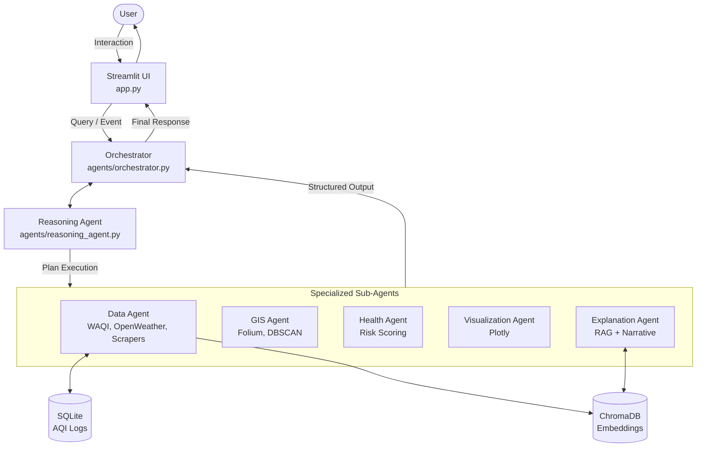
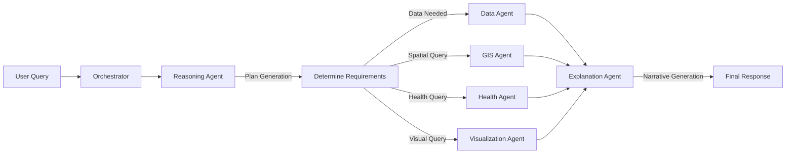
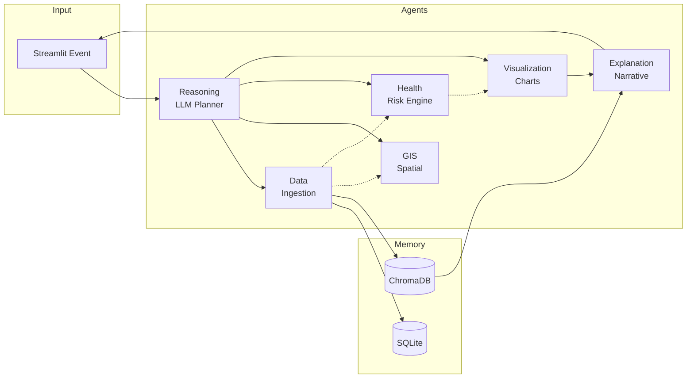
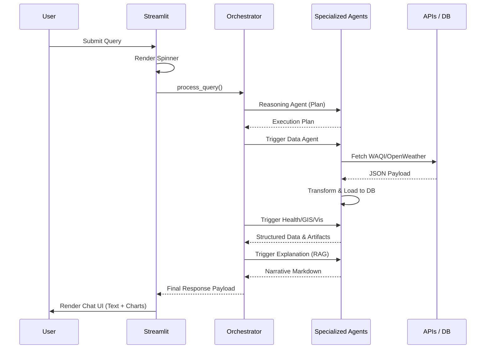

# 🌫️ Multimodal AI Agent for AQI Health Risk Intelligence System

A production-grade **Multi-Agent AI platform** for real-time and historical AQI analysis, geospatial pollution mapping, and persona-aware health risk scoring — built for Indian cities, with Mumbai as the primary target.

---

## Capstone Framing

This project represents an advanced AI engineering capstone, moving beyond basic chat interfaces into a fully assembled multi-agent AI system. It incorporates structured state management, persistent memory (ChromaDB + SQLite), multi-layer fallback mechanisms, deterministic execution, and real-world data ingestion. 

### Problem Statement

Air quality monitoring systems face two opposing requirements:
1. **Conversational flexibility** - Citizens want to ask free-form natural language questions ("Is it safe for my asthmatic child to go out in Bandra today?", "What are the AQI trends for PM2.5?").
2. **Operational correctness** - Health risk scoring, pollutant calculations, and geospatial clustering must be exact, scientifically accurate, and deterministically grounded.

A single LLM cannot satisfy both: it will hallucinate specific pollutant levels or miscalculate risk thresholds. This project solves that gap with a **hierarchical multi-agent graph** where each responsibility is isolated into specialized nodes.

### Business Use Case

The system acts as a comprehensive Health-Risk Intelligence Platform for Indian metropolitan areas. It supports multiple user journeys across a **6-tab Streamlit interface**:
| Journey | Target Audience | Key Features |
|---|---|---|
| **Live Monitoring** | General Public | Real-time AQI metrics, Folium station maps, baseline health panel |
| **Conversational AI** | Everyday Users | Natural language queries handled by a multi-agent orchestrator |
| **Trend Analysis** | Researchers/Analysts | Historical time-series, multi-pollutant overlays, daily averages |
| **Spatial Analysis** | City Planners | DBSCAN clustering, hotspot detection, heatmap overlays |
| **Persona Health** | Sensitive Groups | 10-persona deep-dive risk scoring (e.g., Asthma, Elderly, Athletes) |

### Technical Complexity

| Dimension | What's hard | How it's solved |
|---|---|---|
| **Orchestration** | Complex user queries require data, GIS, health, and visualization steps | **Reasoning Agent + Orchestrator** plan steps and coordinate sub-agents |
| **Data Resiliency** | Real-time API endpoints (WAQI, OpenWeather) can fail or hit rate limits | **5-layer fallback chain**: WAQI → OpenWeather → Scraping → CSV → Mock Data |
| **Spatial Clustering** | Grouping nearby stations with varying pollution levels | **DBSCAN ML clustering** via the GIS Agent |
| **Risk Scoring** | Generalized AQI does not reflect individual persona risks | Deterministic **Health Agent** with 10 specific persona thresholds |
| **Contextual Memory** | LLMs lose track of specific station data during generation | **ChromaDB RAG pipeline** injects real-time data into the Explanation Agent |

---

## System Architecture

### High Level System Architecture



### Agent Workflow



---

## Pipeline Overview

End-to-end lifecycle of a complex user query (e.g., "Show me AQI trends in Mumbai and the risk for asthma patients"):

```mermaid
flowchart LR
    A[1. User Types Query] --> B[2. Orchestrator Receives]
    B --> C[3. Reasoning Agent Plans]
    C --> D[4. Data Agent Fetches WAQI/DB]
    D --> E[5. Health Agent Calculates Score]
    E --> F[6. Vis Agent Generates Chart]
    F --> G[7. Explain Agent Summarizes via RAG]
    G --> H[8. Orchestrator Merges]
    H --> I[9. UI Renders Response]
```



---

## Agent Responsibilities & Data Flow

All agents communicate via a unified Pydantic JSON schema (`AgentMessage`), ensuring structured data handoffs instead of prompt-based string parsing.



---

## Technology Stack

| Layer | Technology | Version | Role |
|---|---|---|---|
| Language | Python | 3.11+ | Runtime |
| UI | Streamlit, streamlit-folium | 1.30+ | Interactive Dashboard & Chat |
| Agent Orchestration | Custom Framework | - | Structured JSON Messaging |
| LLM Integration | Groq, OpenAI | - | High-speed inference |
| Geospatial & Charts | Folium, Plotly, GeoPandas | - | Map & Chart Generation |
| Machine Learning | scikit-learn | - | DBSCAN Spatial Clustering |
| Relational DB | SQLAlchemy + SQLite | 2.0+ | Telemetry & Fallback Data |
| Vector DB | ChromaDB | - | RAG Document Store |
| Embeddings | sentence-transformers | - | `all-MiniLM-L6-v2` |
| Data Processing | pandas, NumPy | - | Aggregations |
| Network & Scraping| aiohttp, requests, BS4 | - | API & Web Scraping |
| Env Config | python-dotenv | - | Loads `.env` |

---

## Project Structure

```text
aqi_multiagent/
├── app.py                    # Streamlit UI (6 tabs)
├── config.py                 # AQI categories, personas, city coords
├── requirements.txt
├── .env.example
│
├── agents/
│   ├── base_agent.py         # Abstract base with timing + DB logging
│   ├── orchestrator.py       # Main system orchestrator
│   ├── reasoning_agent.py    # LLM planner
│   ├── data_agent.py         # Data ingestion + fallback chain
│   ├── gis_agent.py          # Spatial analysis + DBSCAN
│   ├── health_agent.py       # Persona risk engine
│   ├── visualization_agent.py# Map + chart generation
│   └── explanation_agent.py  # LLM narrative + RAG
│
├── schemas/
│   └── agent_messages.py     # Pydantic v2 schemas for all messages
│
├── tools/
│   ├── aqi_tools.py          # CPCB AQI calculation utilities
│   ├── geo_tools.py          # Haversine, geocoding, bounding boxes
│   └── health_tools.py       # Risk scoring, pollutant health effects
│
├── data/
│   ├── database.py           # SQLAlchemy SQLite layer
│   ├── vector_store.py       # ChromaDB + sentence-transformers
│   ├── sample_data.py        # Realistic Mumbai mock data generator
│   ├── db/                   # SQLite database files
│   └── chroma/               # ChromaDB persistence
│
├── utils/
│   ├── logger.py             # Loguru rotating logger
│   └── retry.py              # Tenacity retry decorators
│
└── logs/                     # Application logs
```

---

## Application Flow (Streamlit UI)



---

## Data Sources & Fallback Chain

The system is designed with a highly resilient **5-layer data ingestion fallback chain** to ensure 100% uptime:

```text
1. WAQI API (primary)          — aqicn.org/api/
2. OpenWeather Air Pollution   — openweathermap.org/api/air-pollution
3. Web scraping                — aqi.in, waqi.info
4. User CSV upload             — any standard AQI CSV
5. Mock data                   — realistic Mumbai profile (always available)
```

---

## Getting Started

### Prerequisites

- Python **3.11+**
- API keys for LLM (Groq or OpenAI)
- (Optional) API keys for WAQI and OpenWeather

### Quick Start

```bash
# 1. Clone
git clone <your-repo>
cd Multimodal-AI-Agent-for-AQI-Health-Risk-Analysis-main

# 2. Virtualenv
python -m venv venv
source venv/bin/activate            # Windows: venv\Scripts\activate

# 3. Dependencies
pip install -r requirements.txt

# 4. Configuration
cp .env.example .env
# Edit .env and set your API keys

# 5. Launch
streamlit run app.py
```

Opens locally at `http://localhost:8501`.

---

## Configuration

All configuration is environment-driven. Edit `.env` to set your credentials.

| Variable | Required | Purpose |
|---|---|---|
| `GROQ_API_KEY` | Yes* | Ultra-fast LLM inference (*or OpenAI) |
| `OPENAI_API_KEY` | Yes* | Fallback LLM inference (*or Groq) |
| `WAQI_API_KEY` | No | Primary data source |
| `OPENWEATHER_API_KEY`| No | Secondary data source |
| `LLM_PROVIDER` | Yes | `groq` or `openai` |
| `DB_PATH` | No | Defaults to `data/db/aqi.db` |
| `CHROMA_PATH` | No | Defaults to `data/chroma` |

---

## Agent Communication Protocol

All agents exchange data using a strictly typed Pydantic model (`AgentMessage`). This prevents prompt parsing errors and ensures determinism.

```json
{
  "message_id": "uuid",
  "source_agent": "REASONING",
  "target_agent": "HEALTH",
  "timestamp": "2024-01-01T00:00:00Z",
  "status": "success",
  "payload": {
    "data_output": { "readings": [...], "city": "Mumbai" },
    "persona": "asthma_patients",
    "exposure_hours": 8
  },
  "errors": []
}
```

---

## Testing & Resiliency

- **Tenacity Retries:** Network calls to external APIs are wrapped with exponential backoff.
- **Pydantic Validation:** All incoming external data is validated against strict schemas before DB insertion.
- **Loguru Tracing:** Every agent handoff, data extraction, and tool execution is logged for observability.

---

## Deployment

### Docker Deployment

```bash
docker build -t aqi-system .
docker run -p 8501:8501 --env-file .env aqi-system
```

### Streamlit Cloud
1. Push your repository to GitHub.
2. Connect to [share.streamlit.io](https://share.streamlit.io).
3. Set your secrets from `.env.example` in the Streamlit Cloud advanced settings.
4. Deploy!

### Production Hardening
- **Rate limiting**: Add Redis-based rate limiting on API calls.
- **Caching**: Implement `@st.cache_data` for static UI elements.
- **Scaling**: Replace SQLite with PostgreSQL and ChromaDB with Pinecone.

---

## Roadmap

- Transition from SQLite to PostgreSQL for concurrent writes.
- Implement streaming tokens for the Explanation Agent in the Streamlit UI.
- Expand persona configurations to include dynamic thresholds based on specific user health records.
- Integrate a dedicated Alerting system for SMS/Email notifications on Severe AQI breaches.
- Optional FastAPI Backend integration for Headless API execution.

---

## License

MIT License — see `LICENSE` for details.

---

<div align="center">
  <sub>Built as a Multimodal AI Agent for Environmental Health Intelligence</sub>
</div>
